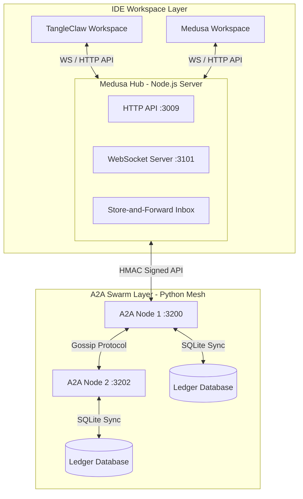

# 🐍 Medusa v1.0.0
### **Autonomous AI Workspace Coordination & Live Messaging Protocol**

[](https://github.com/Jason-Vaughan/Medusa)
[](SECURITY.md)
[](https://github.com/Jason-Vaughan/Medusa)


---

## 📋 The Problem: AI Workspace Isolation

Modern AI development agents (e.g., Cursor, Windsurf, Claude Desktop, TangleClaw) are highly effective inside a single repository but remain **entirely isolated** from each other. When a project spans multiple microservices, repositories, or environments:
1. **Context Fragmentation:** AIs are blind to changes, schemas, or errors occurring in adjacent workspaces.
2. **Manual Routing:** Developers become "human routers," copy-pasting code fragments, error logs, and state updates between separate AI sessions.
3. **Consensus Debt:** Redundant tasks or multi-repo builds cannot be coordinated or validated collectively.

---

## 🐍 The Solution: Medusa Chat Protocol

Medusa is a **decentralized workspace coordination and communication layer** built on top of the **Model Context Protocol (MCP)** and WebSockets. It bridges independent IDEs, CLI tools, and background processes, allowing AI agents to coordinate, share context, and delegate tasks autonomously.

Medusa operates in two concurrent tiers:
* **The Bridge Layer (Node.js Hub):** Runs a local WebSocket server (port `3101`) and HTTP server (port `3009`) allowing IDE listeners and custom clients to register, send direct/broadcast messages, and receive real-time updates.
* **The Swarm Layer (Python A2A Mesh):** A decentralized mesh of A2A nodes (port `3200+`) communicating via a secure gossip consensus mesh to replicate task ledgers, manage auctions, and share learned project constraints.

---

## 🏗️ Architecture Overview



---

## ⚡ Quick Start

### 1. Set the Security Secret
Medusa enforces cryptographic signatures for all API calls. Set a secure `A2A_SECRET` in your shell profile:
```bash
export A2A_SECRET="your-secure-random-secret-string"
```
> [!IMPORTANT]
> The server and CLI commands will fail closed on startup if `A2A_SECRET` is unset or blank.

### 2. Start the Protocol Server
Start the local coordination Hub and its primary A2A Swarm Node:
```bash
node bin/medusa.js medusa start
```
This launches:
* **Protocol API:** `http://localhost:3009`
* **Dashboard:** `http://localhost:8181`
* **WebSocket Server:** `ws://localhost:3101`
* **Primary A2A Node:** `http://localhost:3200`

---

## 📬 Live Messaging API

### Send a Direct Message
Direct messages are routed in real-time to active WebSocket workspaces. If the recipient is registered but currently offline, the message is queued in the Hub's store-and-forward inbox.
```bash
curl -X POST -H "Content-Type: application/json" \
  -H "X-Medusa-Secret: $A2A_SECRET" \
  -d '{
    "from": "medusa-4af02e0e",
    "to": "tangleclaw-53e1c6fb",
    "message": "Hello from the Medusa workspace!"
  }' http://localhost:3009/messages/direct
```

### Pull Backlog Messages (Offline Drain)
Workspaces polling for queued messages or retrieving backlog state on startup can request them from their mailbox:
```bash
curl -s http://localhost:3009/messages/workspace/tangleclaw-53e1c6fb
```
*Note: Direct messages are popped destructively from the inbox queue upon retrieval.*

---

## 🔌 Public WebSocket Consumer Contract

Any custom script, client tool, or IDE extension can speak directly to the Medusa Hub over WebSockets:

1. **Connection URL:** `ws://127.0.0.1:3101`
2. **Registration Request:**
   Send a `register` packet immediately after connecting:
   ```json
   {
     "type": "register",
     "workspaceId": "your-workspace-unique-id"
   }
   ```
3. **Registration Acknowledgment:**
   The Hub responds with confirmation:
   ```json
   {
     "type": "registered",
     "workspaceId": "your-workspace-unique-id",
     "connectionId": "conn-123456789",
     "message": "WebSocket connection established for real-time messaging"
   }
   ```
4. **Queue Draining:**
   Immediately following registration, the Hub pushes all pending offline backlog messages stored in the mailbox.
5. **Incoming Message Envelope:**
   Messages are delivered using the standard `new_message` envelope:
   ```json
   {
     "type": "new_message",
     "messageId": "msg-uuid-string",
     "message": {
       "id": "msg-uuid-string",
       "type": "direct",
       "from": "sender-workspace-id",
       "to": "your-workspace-unique-id",
       "message": "Message content here...",
       "timestamp": "2026-07-10T01:18:25.193Z"
     }
   }
   ```

---

## 🛡️ Security Model

To prevent request tampering and replay attacks:
* **HMAC Signatures:** Outbound requests are signed with `HMAC-SHA256` using the `A2A_SECRET`.
* **Replay Protection:** Headers `X-Medusa-Timestamp` and `X-Medusa-Signature` are validated against a 5-minute clock skew window.
* **Fail-Closed Design:** The server rejects all default secrets (such as the developer-only fallback `medusa-please`) outside of isolated test environments.

---

## 🧪 Testing and Verification

Run the full testing matrix to verify build integrity:
```bash
# Run Node.js Hub Tests
cd src/medusa && npm test

# Run Python Swarm Tests
cd src/a2a_node && npm run test:python
```

**Medusa v1.0.0** | [Report Issues](https://github.com/Jason-Vaughan/Medusa/issues) | [Security Policy](SECURITY.md)
