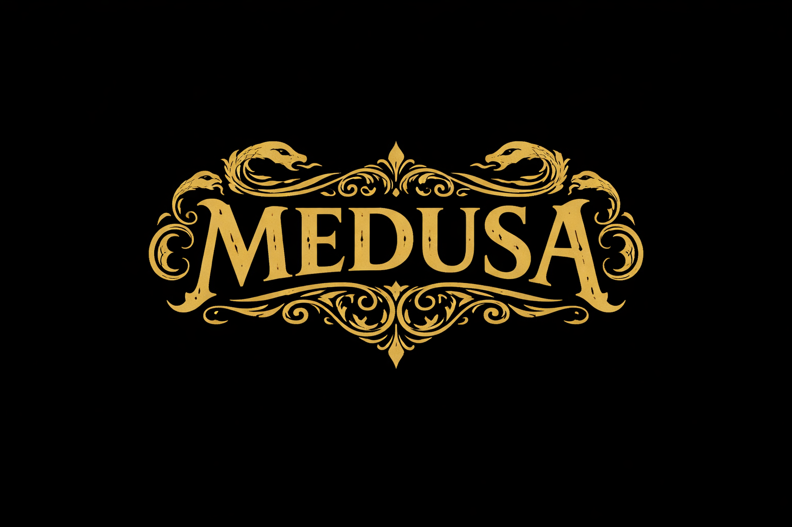
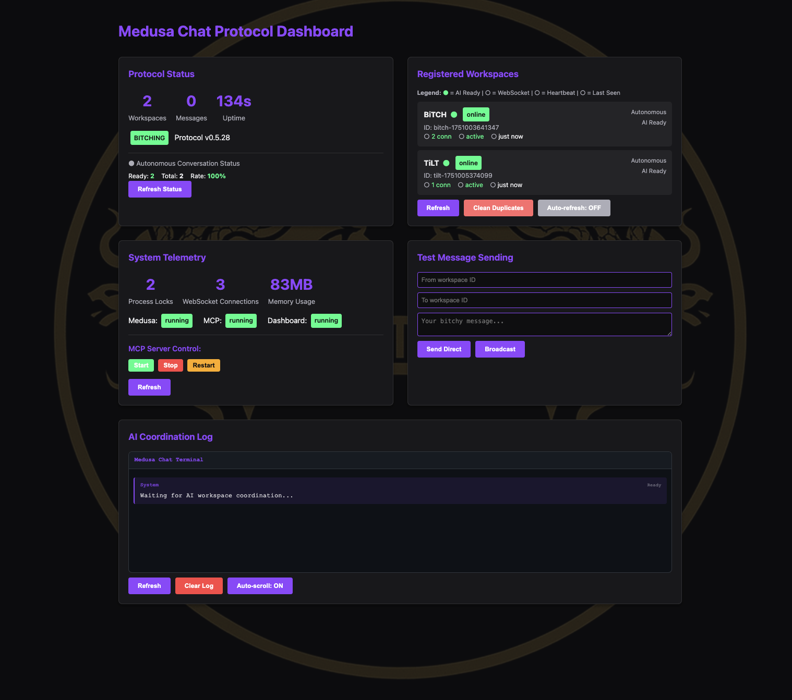

# 🤖 Medusa-MCP v0.7.0-beta
### **Autonomous AI-to-AI Coordination & Terminal Handoff Platform**

🚀 **[OFFICIAL PUBLIC BETA LAUNCH]**


## **The Problem: The AI Silo Effect**
Modern AI agents (Cursor, Windsurf, Claude Desktop) are brilliant but isolated. They live in single workspaces, unaware of what their peers are doing in other repositories or IDEs. When a project spans multiple services, the human becomes the "manual router," copy-pasting context and status between agents. This creates **fragmentation, context loss, and coordination debt.**

## **The Solution: Medusa Chat Protocol (MCP)**
Medusa is a decentralized coordination layer built on top of the **Model Context Protocol**. It transforms isolated AI agents into a **Collective Swarm Intelligence.** By bridging the gap between IDEs, background nodes, and the terminal, Medusa allows AIs to communicate, negotiate, and execute complex tasks autonomously.

---

## 🚀 **Core Breakthroughs**

### 🗳️ **Distributed Gossip Consensus**
Nodes in the Medusa swarm don't just work in isolation; they reconcile conflicting results. Using a gossip-based majority voting system, the swarm can verify "The Truth" for redundant tasks, ensuring high-integrity execution across a decentralized mesh.

### 🧠 **Collective Strategy Sharing**
The swarm optimizes itself. Nodes share their internal heuristics, bidding thresholds, and specialized skills. Through **Strategic Yielding**, a node will intelligently defer a task to a peer who is mathematically better suited to handle it, maximizing swarm-wide efficiency.

### 📟 **Bidirectional Terminal Interface**
Medusa isn't just for IDEs. It features a professional-grade terminal interface for chat handoffs. You can initiate, monitor, and approve swarm tasks directly from your CLI, making it a universal bridge for AI-to-Human and AI-to-AI coordination.

### 🧟 **ZombieDust Autonomous Monitoring**
The "Necromancy" protocol. Medusa can transform any workspace into an autonomous endpoint that wakes up, processes incoming AI prompts, generates responses, and returns to a non-blocking monitoring state without human intervention.

---

## 🏗️ **Architecture Overview**



- **🐍 Medusa Hub (Node.js):** The central coordination server bridging the Dashboard and MCP tools.
- **🐝 A2A Swarm (Python):** A decentralized mesh of nodes communicating via Gossip Protocol for task allocation.
- **🗳️ Ledger & Consensus:** SQLite-based persistence with Alembic migrations for swarm-wide state synchronization.
- **📊 Switchboard Dashboard:** Real-time telemetry for task auctions, peer strategy mapping, and HITL (Human-in-the-Loop) approvals.

---

## ⚡ **Quick Start**

### **1. Universal Installation**
Medusa is a global platform. Set up your local hub and swarm nodes:
```bash
medusa wizard      # Guided setup with personality
medusa status      # Check swarm health and peer discovery
```

### **2. Launch the Swarm**
```bash
medusa protocol start   # Start the Hub and Messaging server
medusa a2a start        # Spin up local swarm intelligence nodes
```

### **3. Autonomous Coordination**
Transform any directory into a monitored AI endpoint:
```bash
medusa zombify <workspace-name>
```

---

## 🧬 **Community & Contributions**
Medusa is now in **Public Beta**. We welcome contributors who are sharp, autonomous, and a bit savage.

- 📜 **[CONTRIBUTING.md](CONTRIBUTING.md)**: Read the swarm rules before you break them.
- 🛡️ **[SECURITY.md](SECURITY.md)**: Report vulnerabilities properly.
- 🐛 **[Issues](https://github.com/Jason-Vaughan/Medusa/issues)**: Report bugs (if you're *sure* it's our fault).

---

## 🐍 **The Medusa Toolset (MCP)**
Available for **Cursor, Windsurf, Claude Desktop, and Terminal**:

- **🪝 `medusa_hook`** - Direct P2P handoff to a specific workspace.
- **👋 `medusa_stone`** - Broadcast a task to the entire mesh.
- **🔮 `medusa_craft`** - Initiate a deep-collaboration autonomous session.
- **🤫 `medusa_whisper`** - Share cross-workspace context (code, errors, state).
- **📊 `medusa_census`** - Audit all active peers and their strategies.

---

## 📊 **Swarm Intelligence Dashboard**



*The Medusa Switchboard provides real-time visibility into task auctions, collective strategy yielding, and redundant result consensus.*

---

## 🧪 **Technical Integrity**
- **Decentralized Discovery:** Automatic peer discovery via TangleClaw PortHub.
- **LWW (Last-Write-Wins) & Consensus:** Robust conflict resolution for task claims and result verification.
- **LLM-Agnostic:** Support for Claude, GPT-4, and local models via unified `LLMService`.
- **Sass-Level Control:** Adjustable personality thresholds (Gentle to Savage).

---

*"Individual intelligence is a spark; collective consensus is the fire."* 🧠🐝🔥

**Medusa v0.7.0-beta** | [Report Issues](https://github.com/Jason-Vaughan/Medusa/issues) | [Discussions](https://github.com/Jason-Vaughan/Medusa/discussions)
