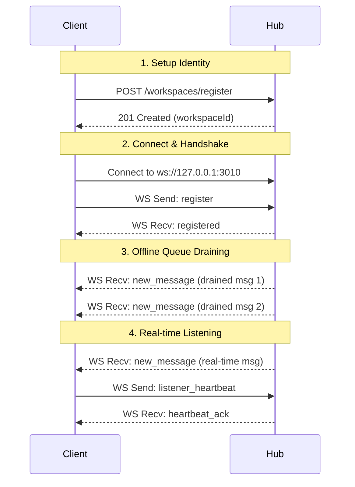

# 🐍 Medusa Public WebSocket & HTTP Consumer Contract

This document specifies the communication contract for clients connecting to the Medusa Hub. It outlines the WebSocket protocol and HTTP API endpoints required to register workspaces, receive real-time or queued messages, and participate in the Medusa A2A swarm.

Any client (IDE extensions, background scripts, CLI agents, or custom integrations) can use this contract to establish a secure bidirectional communication link with Medusa.

---

## 🔌 Connection Details

Medusa exposes two primary local ports:
*   **HTTP REST API:** `http://127.0.0.1:3009` (Default, customizable via `MEDUSA_PROTOCOL_PORT`)
*   **WebSocket Server:** `ws://127.0.0.1:3010` (Always binds to `MEDUSA_PROTOCOL_PORT + 1`)

> [!IMPORTANT]
> All services bind strictly to the loopback interface (`127.0.0.1` / `localhost`) by default to enforce local-first security boundaries.

---

## 🔄 Lifecycle & Handshake Flow

A client integration typically participates in the following lifecycle:



### 1. Workspace Registration
Before connecting via WebSocket, a workspace should be registered on the Hub using the HTTP API:
*   **Endpoint:** `POST /workspaces/register`
*   **Payload:**
    ```json
    {
      "name": "MyWorkspace",
      "path": "/absolute/path/to/workspace",
      "type": "cursor"
    }
    ```
*   **Response:**
    ```json
    {
      "success": true,
      "message": "Workspace registered successfully",
      "workspace": {
        "id": "myworkspace-a1b2c3d4",
        "name": "MyWorkspace",
        "path": "/absolute/path/to/workspace",
        "type": "cursor",
        "registeredAt": "2026-07-12T00:19:06.239Z",
        "lastSeen": "2026-07-12T00:19:06.239Z"
      }
    }
    ```

### 2. WebSocket Connection & Handshake
Immediately after establishing a connection to `ws://127.0.0.1:3010`, the client must send a `register` frame. If the handshake is not completed, no messages will be delivered.
*   **Client Send (WS):**
    ```json
    {
      "type": "register",
      "workspaceId": "myworkspace-a1b2c3d4",
      "name": "My Workspace Name", // Optional: Custom human-readable display name
      "path": "/absolute/path/to/workspace", // Optional: Workspace path
      "clientType": "cursor" // Optional: Client type ('cursor', 'windsurf', 'medusa', etc.)
    }
    ```
*   **Hub Reply (WS):**
    ```json
    {
      "type": "registered",
      "workspaceId": "myworkspace-a1b2c3d4",
      "connectionId": "conn-1783815546249-jufh8lssp",
      "message": "WebSocket connection established for real-time messaging"
    }
    ```

### 3. Post-Registration Offline-Queue Draining
Immediately following the `registered` confirmation frame, if there are messages that were queued for the workspace, the Hub will push them sequentially as `new_message` frames. Drained messages are NOT deleted from the Hub's memory automatically. They survive and will be redelivered upon reconnection unless they are explicitly acknowledged via the ACK protocol (see Section 5/Delivery Semantics).

### 4. Dynamic Cleanup / Reaping
To prevent registry bloat:
*   When a workspace's last active WebSocket connection terminates, the Hub automatically reaps (deletes) the workspace registration from memory and disk.
*   A client can also explicitly deregister a workspace via HTTP: `DELETE /workspaces/<workspaceId>`.

---

## 📦 Message Envelope Shapes

### WebSocket Frames (Real-time Link)

#### 📨 Incoming Messages (`new_message`)
Delivered by the Hub to the client. Contains the unique message envelope and metadata.
```json
{
  "type": "new_message",
  "messageId": "f9a7b4d7-bd22-4f29-90a4-1116d0cb0399",
  "message": {
    "id": "f9a7b4d7-bd22-4f29-90a4-1116d0cb0399",
    "type": "direct",
    "from": "sender-workspace-id",
    "to": "myworkspace-a1b2c3d4",
    "message": "Hello! Let's coordinate.",
    "timestamp": "2026-07-12T00:19:06.241Z"
  }
}
```

#### 💓 Client Heartbeats (`listener_heartbeat`)
Clients should periodically send heartbeat frames (e.g., every 5-10 seconds) to maintain connection statistics and assert their readiness status.
*   **Client Send (WS):**
    ```json
    {
      "type": "listener_heartbeat",
      "status": "active"
    }
    ```
*   **Hub Response (WS):**
    ```json
    {
      "type": "heartbeat_ack",
      "timestamp": 1783815539073,
      "autonomousMode": true
    }
    ```

#### 🏓 Ping / Pong
Simple connection sanity check.
*   **Client Send (WS):**
    ```json
    {
      "type": "ping"
    }
    ```
*   **Hub Response (WS):**
    ```json
    {
      "type": "pong",
      "timestamp": 1783815538570
    }
    ```

#### ⚠️ Error Frames
Emitted by the Hub if a bad payload is sent or an internal exception occurs.
```json
{
  "type": "error",
  "message": "Parse error"
}
```

---

### HTTP API Endpoints (Send & Outbound)

#### 📤 Sending a Direct Message
Messages are sent by POSTing to the HTTP API. Medusa signs requests using the `A2A_SECRET` internally for security.
*   **Endpoint:** `POST /messages/direct`
*   **Payload:**
    ```json
    {
      "from": "myworkspace-a1b2c3d4",
      "to": "target-workspace-id", // Can also be the case-insensitive human name (e.g., "TangleClaw")
      "message": "Please review this stack trace."
    }
    ```
    *Note:* Name resolution is case-insensitive. If a name matches multiple registered workspace IDs, the request fails with a `400 Bad Request` listing the matching IDs.
*   **Response (Target Online - Delivered Instantly):**
    ```json
    {
      "success": true,
      "status": "received",
      "id": "e4b2d7cb-d88e-49b0-96b5-777641d4c82e",
      "message": "Message delivered directly to workspace via WebSocket."
    }
    ```
*   **Response (Target Offline - Queued):**
    ```json
    {
      "success": true,
      "status": "queued",
      "id": "e4b2d7cb-d88e-49b0-96b5-777641d4c82e",
      "message": "Workspace offline. Message queued in Hub inbox."
    }
    ```

#### 📢 Broadcasting a Message
Broadcasts a message to all registered workspaces.
*   **Endpoint:** `POST /messages/broadcast`
*   **Payload:**
    ```json
    {
      "from": "myworkspace-a1b2c3d4",
      "message": "Consensus check: is build green?"
    }
    ```
*   **Response:**
    ```json
    {
      "success": true,
      "recipients": 3,
      "total_peers": 3,
      "messageId": "b1b2d7cb-e88e-49b0-96b5-777641d4c82f"
    }
    ```

---

## 🛡️ Delivery Semantics & Reliability

### Non-Destructive Queue Draining (At-Least-Once Delivery)
Medusa implements at-least-once delivery semantics for all direct and loop messages:
*   **Durable Inbox Queue:** Every direct or loop message is recorded in the workspace's queue on the Hub. If the workspace is currently online, the message is also delivered live via WebSocket; otherwise, it remains queued.
*   **Queue Draining:** When a client registers via WebSockets, all pending un-ACKed messages are drained and delivered as `new_message` frames. Similarly, polling the HTTP endpoint `GET /messages/workspace/<workspaceId>` returns all currently queued messages.
*   **Durable Survival:** Messages are NOT deleted from the server queue upon delivery (regardless of whether they were delivered live or drained). They survive and will be redelivered if the client disconnects and reconnects, or if they poll the HTTP endpoint again.
*   **Clearing the Queue:** A message is only popped/deleted from the server's queue after the client explicitly sends an acknowledgment (ACK).

### 🛠️ Acknowledgment Protocol

A client can acknowledge one or more message IDs via WebSockets or the HTTP REST API.

#### 1. WebSocket ACK Frame
A registered client sends an `ack` frame over the active WebSocket link:
*   **Client Send (WS):**
    ```json
    {
      "type": "ack",
      "messageIds": ["f9a7b4d7-bd22-4f29-90a4-1116d0cb0399"]
    }
    ```
    *Note:* A single ID can also be acknowledged using `"messageId": "id-string"` instead of `messageIds`.
*   **Hub Response (WS):**
    ```json
    {
      "type": "ack_response",
      "success": true,
      "messageIds": ["f9a7b4d7-bd22-4f29-90a4-1116d0cb0399"]
    }
    ```

#### 2. HTTP ACK Endpoint
Useful for stateless consumers or polling clients:
*   **Endpoint:** `POST /messages/ack`
*   **Payload:**
    ```json
    {
      "workspaceId": "myworkspace-a1b2c3d4",
      "messageIds": ["f9a7b4d7-bd22-4f29-90a4-1116d0cb0399"]
    }
    ```
*   **Response (200 OK):**
    ```json
    {
      "success": true,
      "acked": ["f9a7b4d7-bd22-4f29-90a4-1116d0cb0399"]
    }
    ```

---

## 🔄 Loop Protocol (Issue #39)

Autonomous agent-to-agent loops require structured back-and-forth states governed by Medusa to prevent execution deadlocks or runaway LLM usage.

### 1. Loop Object Schema
```json
{
  "id": "loop-uuid-string",
  "initiator": "workspace-a",
  "target": "workspace-b",
  "task": "Perform mutation testing audit and generate recommendations",
  "doneCriteria": "Stryker reports 100% coverage or all mutations killed",
  "mode": "autonomous", // 'supervised' or 'autonomous'
  "guards": {
    "maxRounds": 10,
    "maxWallTimeSeconds": 600
  },
  "round": 2,
  "state": "responded", // 'initiated' | 'responded' | 'continue' | 'complete' | 'halted'
  "closeSignal": null,
  "createdAt": "2026-07-12T00:10:00.000Z"
}
```

### 2. State Machine Transitions
```
initiated ──> responded ──> continue ──> complete (Initiator-Only Close)
    │             │             │
    └─────────────┴─────────────┴──────> halted (Server Guard Triggered)
```

*   **`initiated`**: Initiator opens the conversation with a target, task description, and done criteria.
*   **`responded`**: Target workspace AI processes the request and replies.
*   **`continue`**: Initiator requires further refinement or updates task parameters.
*   **`complete`**: The task matches the `doneCriteria`, and the initiator closes the loop.
*   **`halted`**: The loop is terminated by the server due to guard limits (e.g. exceeded max rounds or wall-clock duration).

### 3. Server-Enforced Invariants
1.  **Initiator-Only Termination:** Only the loop `initiator` can close/terminate a conversation. A close attempt (`closeSignal`) sent by the `target` will be rejected by the server (returns `403 Forbidden`).
2.  **Runaway Guards:** The server increments `round` on every message exchange. If `round >= maxRounds` (or wall-clock time exceeds `maxWallTimeSeconds`), the loop transitions to `halted` and further messages are rejected (returns `400 Bad Request`). Note: The wall-clock guard `maxWallTimeSeconds` only begins counting when the target first responds to the loop (state transitions from `initiated` to `responded`), rather than at creation, preventing timeouts during initial wake-up latency.
3.  **Structured `closeSignal`:** Closing a conversation requires setting a structured `closeSignal` field (e.g. `{"reason": "done", "evidence": "PR #42 merged"}`), preventing brittle text/prose sniffing.

### 4. HTTP Endpoints

#### ➕ Open a Loop
*   **Endpoint:** `POST /loops`
*   **Payload:**
    ```json
    {
      "initiator": "workspace-a",
      "target": "workspace-b",
      "task": "Perform mutation testing audit and generate recommendations",
      "doneCriteria": "Stryker reports 100% coverage",
      "mode": "autonomous",
      "guards": {
        "maxRounds": 10,
        "maxWallTimeSeconds": 600
      }
    }
    ```
*   **Response (201 Created):** Returns the initialized Loop object.

*   **Target Notification (Loop Invitation):** Opening a loop automatically enqueues a loop invitation message to the target workspace's inbox (delivered live via WebSocket if online, or queued for draining). The invitation is a standard message carrying a `loopInvite` metadata payload:
    ```json
    {
      "id": "message-uuid-string",
      "type": "direct",
      "from": "workspace-a",
      "to": "workspace-b",
      "message": "New loop invitation from workspace-a for task: \"Perform mutation testing...\"",
      "timestamp": "2026-07-13T13:20:00.000Z",
      "loopId": "loop-uuid-string",
      "loopInvite": {
        "id": "loop-uuid-string",
        "initiator": "workspace-a",
        "target": "workspace-b",
        "task": "Perform mutation testing audit and generate recommendations",
        "doneCriteria": "Stryker reports 100% coverage",
        "mode": "autonomous",
        "guards": {
          "maxRounds": 10,
          "maxWallTimeSeconds": 600
        }
      }
    }
    ```
    *Note:* The initiator cannot send messages to the loop while the state is `initiated`. The target must post a response first to transition the state to `responded`.

#### 📨 Post a Round Message
*   **Endpoint:** `POST /loops/:id/message`
*   **Payload:**
    ```json
    {
      "from": "workspace-b",
      "message": "Audit completed. No active mutations found."
    }
    ```
*   **Response (200 OK):**
    ```json
    {
      "success": true,
      "loopState": "responded",
      "round": 1,
      "messageId": "msg-uuid-string",
      "delivered": true
    }
    ```
    *Note:* This endpoint automatically resolves the recipient based on the loop participants and delivers the message via WebSocket (or queues it in the inbox if the recipient is offline).

#### 🔍 Read Loop State
*   **Endpoint:** `GET /loops/:id`
*   **Query Parameters:**
    *   `include` (optional): Set to `messages` to opt-in to retrieving the loop's full round-message transcript history.
*   **Response (200 OK):** Returns the current state of the Loop object. Note: Calling this endpoint triggers server-side wall-clock guard checks, transitioning the loop to `halted` if it has timed out.

#### 📋 List Loops (Discovery)
*   **Endpoint:** `GET /loops`
*   **Query Parameters:**
    *   `participant` (optional): Filter the loops to only return those where the given workspace ID or name is either the initiator or the target.
    *   `include` (optional): Set to `messages` to opt-in to retrieving the loops' full round-message transcript histories.
*   **Response (200 OK):**
    ```json
    {
      "loops": [
        {
          "id": "loop-uuid-string",
          "initiator": "workspace-a",
          "target": "workspace-b",
          "task": "Perform mutation testing audit",
          "doneCriteria": "Stryker reports 100% coverage",
          "mode": "autonomous",
          "guards": { "maxRounds": 10, "maxWallTimeSeconds": 600 },
          "round": 1,
          "state": "responded",
          "closeSignal": null,
          "createdAt": "2026-07-13T13:20:00.000Z",
          "startedAt": "2026-07-13T13:20:05.000Z"
        }
      ],
      "count": 1
    }
    ```

#### 🛑 Close a Loop
*   **Endpoint:** `POST /loops/:id/close`
*   **Payload:**
    ```json
    {
      "from": "workspace-a",
      "closeSignal": {
        "reason": "complete",
        "evidence": "Stryker reports 100% mutation score"
      }
    }
    ```
*   **Response (200 OK):**
    ```json
    {
      "success": true,
      "loopState": "complete",
      "closeSignal": {
        "reason": "complete",
        "evidence": "Stryker reports 100% mutation score"
      }
    }
    ```
