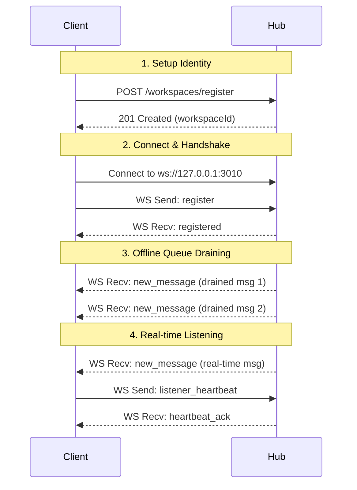

# 🐍 Medusa Public WebSocket & HTTP Consumer Contract

This document specifies the communication contract for clients connecting to the Medusa Hub. It outlines the WebSocket protocol and HTTP API endpoints required to register workspaces, receive real-time or queued messages, and participate in the Medusa A2A swarm.

Any client (IDE extensions, background scripts, CLI agents, or custom integrations) can use this contract to establish a secure bidirectional communication link with Medusa.

---

## 🔌 Connection Details

Medusa exposes two primary local ports:
*   **HTTP REST API:** `http://127.0.0.1:3009` (Default, customizable via `MEDUSA_PROTOCOL_PORT`)
*   **WebSocket Server:** `ws://127.0.0.1:3010` (Always binds to `MEDUSA_PROTOCOL_PORT + 1`)

> [!IMPORTANT]
> All services bind strictly to the loopback interface (`127.0.0.1` / `localhost`) by default to enforce local-first security boundaries.

---

## 🔄 Lifecycle & Handshake Flow

A client integration typically participates in the following lifecycle:



### 1. Workspace Registration
Before connecting via WebSocket, a workspace should be registered on the Hub using the HTTP API:
*   **Endpoint:** `POST /workspaces/register`
*   **Payload:**
    ```json
    {
      "name": "MyWorkspace",
      "path": "/absolute/path/to/workspace",
      "type": "cursor"
    }
    ```
*   **Response:**
    ```json
    {
      "success": true,
      "message": "Workspace registered successfully",
      "workspace": {
        "id": "myworkspace-a1b2c3d4",
        "name": "MyWorkspace",
        "path": "/absolute/path/to/workspace",
        "type": "cursor",
        "registeredAt": "2026-07-12T00:19:06.239Z",
        "lastSeen": "2026-07-12T00:19:06.239Z"
      }
    }
    ```

### 2. WebSocket Connection & Handshake
Immediately after establishing a connection to `ws://127.0.0.1:3010`, the client must send a `register` frame. If the handshake is not completed, no messages will be delivered.
*   **Client Send (WS):**
    ```json
    {
      "type": "register",
      "workspaceId": "myworkspace-a1b2c3d4"
    }
    ```
*   **Hub Reply (WS):**
    ```json
    {
      "type": "registered",
      "workspaceId": "myworkspace-a1b2c3d4",
      "connectionId": "conn-1783815546249-jufh8lssp",
      "message": "WebSocket connection established for real-time messaging"
    }
    ```

### 3. Post-Registration Offline-Queue Draining
Immediately following the `registered` confirmation frame, if there are messages that were queued for the workspace while it was offline, the Hub will push them sequentially as `new_message` frames. Once the queue is completely drained, it is deleted from the Hub's memory.

### 4. Dynamic Cleanup / Reaping
To prevent registry bloat:
*   When a workspace's last active WebSocket connection terminates, the Hub automatically reaps (deletes) the workspace registration from memory and disk.
*   A client can also explicitly deregister a workspace via HTTP: `DELETE /workspaces/<workspaceId>`.

---

## 📦 Message Envelope Shapes

### WebSocket Frames (Real-time Link)

#### 📨 Incoming Messages (`new_message`)
Delivered by the Hub to the client. Contains the unique message envelope and metadata.
```json
{
  "type": "new_message",
  "messageId": "f9a7b4d7-bd22-4f29-90a4-1116d0cb0399",
  "message": {
    "id": "f9a7b4d7-bd22-4f29-90a4-1116d0cb0399",
    "type": "direct",
    "from": "sender-workspace-id",
    "to": "myworkspace-a1b2c3d4",
    "message": "Hello! Let's coordinate.",
    "timestamp": "2026-07-12T00:19:06.241Z"
  }
}
```

#### 💓 Client Heartbeats (`listener_heartbeat`)
Clients should periodically send heartbeat frames (e.g., every 5-10 seconds) to maintain connection statistics and assert their readiness status.
*   **Client Send (WS):**
    ```json
    {
      "type": "listener_heartbeat",
      "status": "active"
    }
    ```
*   **Hub Response (WS):**
    ```json
    {
      "type": "heartbeat_ack",
      "timestamp": 1783815539073,
      "autonomousMode": true
    }
    ```

#### 🏓 Ping / Pong
Simple connection sanity check.
*   **Client Send (WS):**
    ```json
    {
      "type": "ping"
    }
    ```
*   **Hub Response (WS):**
    ```json
    {
      "type": "pong",
      "timestamp": 1783815538570
    }
    ```

#### ⚠️ Error Frames
Emitted by the Hub if a bad payload is sent or an internal exception occurs.
```json
{
  "type": "error",
  "message": "Parse error"
}
```

---

### HTTP API Endpoints (Send & Outbound)

#### 📤 Sending a Direct Message
Messages are sent by POSTing to the HTTP API. Medusa signs requests using the `A2A_SECRET` internally for security.
*   **Endpoint:** `POST /messages/direct`
*   **Payload:**
    ```json
    {
      "from": "myworkspace-a1b2c3d4",
      "to": "target-workspace-id",
      "message": "Please review this stack trace."
    }
    ```
*   **Response (Target Online - Delivered Instantly):**
    ```json
    {
      "success": true,
      "status": "received",
      "id": "e4b2d7cb-d88e-49b0-96b5-777641d4c82e",
      "message": "Message delivered directly to workspace via WebSocket."
    }
    ```
*   **Response (Target Offline - Queued):**
    ```json
    {
      "success": true,
      "status": "queued",
      "id": "e4b2d7cb-d88e-49b0-96b5-777641d4c82e",
      "message": "Workspace offline. Message queued in Hub inbox."
    }
    ```

#### 📢 Broadcasting a Message
Broadcasts a message to all registered workspaces.
*   **Endpoint:** `POST /messages/broadcast`
*   **Payload:**
    ```json
    {
      "from": "myworkspace-a1b2c3d4",
      "message": "Consensus check: is build green?"
    }
    ```
*   **Response:**
    ```json
    {
      "success": true,
      "recipients": 3,
      "total_peers": 3,
      "messageId": "b1b2d7cb-e88e-49b0-96b5-777641d4c82f"
    }
    ```

---

## 🛡️ Delivery Semantics & Reliability

### Destructive Pop-on-Read
In Medusa `v1.0.0-rc`, inbox reads are **destructive**.
*   When a client registers via WebSockets, all pending offline messages are drained and delivered, and the offline queue is immediately deleted from the server memory (`offlineQueues.delete(workspaceId)`).
*   Similarly, polling the HTTP endpoint `GET /messages/workspace/<workspaceId>` returns all offline messages and instantly deletes them from the Hub.
*   **Risk:** If a client consumer crashes or loses connection mid-processing after receiving drained messages but before writing them to disk, **those messages are lost permanently**.

### Roadmap: Non-Destructive Read + Delivery ACK (#33)
> [!NOTE]
> This capability is **open/planned** for future integration to support at-least-once delivery guarantees.
*   **Proposed HTTP Peek:** `GET /messages/workspace/<id>?peek=true` will return pending messages without clearing the queue.
*   **Proposed WS ACK:** A client will acknowledge durable processing by sending:
    ```json
    {
      "type": "ack",
      "messageIds": ["f9a7b4d7-bd22-4f29-90a4-1116d0cb0399"]
    }
    ```
    Messages will only be popped from the Hub's queue after an explicit acknowledgment is received.

---

## 🔄 Loop Protocol (Issue #39)

Autonomous agent-to-agent loops require structured back-and-forth states governed by Medusa to prevent execution deadlocks or runaway LLM usage.

### 1. Loop Object Schema
```json
{
  "id": "loop-uuid-string",
  "initiator": "workspace-a",
  "target": "workspace-b",
  "task": "Perform mutation testing audit and generate recommendations",
  "doneCriteria": "Stryker reports 100% coverage or all mutations killed",
  "mode": "autonomous", // 'supervised' or 'autonomous'
  "guards": {
    "maxRounds": 10,
    "maxWallTimeSeconds": 600
  },
  "round": 2,
  "state": "responded", // 'initiated' | 'responded' | 'continue' | 'complete' | 'halted'
  "closeSignal": null,
  "createdAt": "2026-07-12T00:10:00.000Z"
}
```

### 2. State Machine Transitions
```
initiated ──> responded ──> continue ──> complete (Initiator-Only Close)
    │             │             │
    └─────────────┴─────────────┴──────> halted (Server Guard Triggered)
```

*   **`initiated`**: Initiator opens the conversation with a target, task description, and done criteria.
*   **`responded`**: Target workspace AI processes the request and replies.
*   **`continue`**: Initiator requires further refinement or updates task parameters.
*   **`complete`**: The task matches the `doneCriteria`, and the initiator closes the loop.
*   **`halted`**: The loop is terminated by the server due to guard limits (e.g. exceeded max rounds or wall-clock duration).

### 3. Server-Enforced Invariants
1.  **Initiator-Only Termination:** Only the loop `initiator` can close/terminate a conversation. A close attempt (`closeSignal`) sent by the `target` will be rejected by the server (returns `403 Forbidden`).
2.  **Runaway Guards:** The server increments `round` on every message exchange. If `round >= maxRounds` (or wall-clock time exceeds `maxWallTimeSeconds`), the loop transitions to `halted` and further messages are rejected (returns `400 Bad Request`).
3.  **Structured `closeSignal`:** Closing a conversation requires setting a structured `closeSignal` field (e.g. `{"reason": "done", "evidence": "PR #42 merged"}`), preventing brittle text/prose sniffing.

### 4. HTTP Endpoints

#### ➕ Open a Loop
*   **Endpoint:** `POST /loops`
*   **Payload:**
    ```json
    {
      "initiator": "workspace-a",
      "target": "workspace-b",
      "task": "Perform mutation testing audit and generate recommendations",
      "doneCriteria": "Stryker reports 100% coverage",
      "mode": "autonomous",
      "guards": {
        "maxRounds": 10,
        "maxWallTimeSeconds": 600
      }
    }
    ```
*   **Response (201 Created):** Returns the initialized Loop object.

#### 📨 Post a Round Message
*   **Endpoint:** `POST /loops/:id/message`
*   **Payload:**
    ```json
    {
      "from": "workspace-b",
      "message": "Audit completed. No active mutations found."
    }
    ```
*   **Response (200 OK):**
    ```json
    {
      "success": true,
      "loopState": "responded",
      "round": 1,
      "messageId": "msg-uuid-string",
      "delivered": true
    }
    ```
    *Note:* This endpoint automatically resolves the recipient based on the loop participants and delivers the message via WebSocket (or queues it in the inbox if the recipient is offline).

#### 🔍 Read Loop State
*   **Endpoint:** `GET /loops/:id`
*   **Response (200 OK):** Returns the current state of the Loop object. Note: Calling this endpoint triggers server-side wall-clock guard checks, transitioning the loop to `halted` if it has timed out.

#### 🛑 Close a Loop
*   **Endpoint:** `POST /loops/:id/close`
*   **Payload:**
    ```json
    {
      "from": "workspace-a",
      "closeSignal": {
        "reason": "complete",
        "evidence": "Stryker reports 100% mutation score"
      }
    }
    ```
*   **Response (200 OK):**
    ```json
    {
      "success": true,
      "loopState": "complete",
      "closeSignal": {
        "reason": "complete",
        "evidence": "Stryker reports 100% mutation score"
      }
    }
    ```
